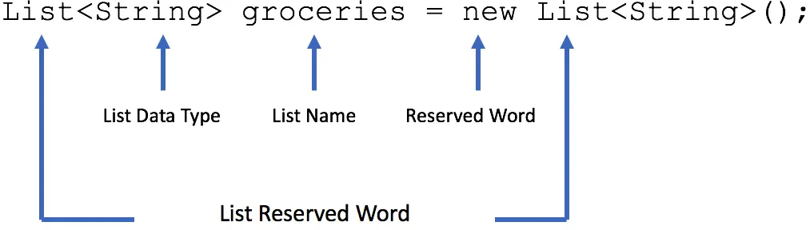
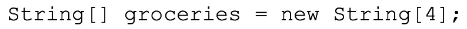

## index
- <a href="#comments">Comments</a>
- <a href="#data-types">Primitive Data types</a>
- <a href="#collections">Collections</a>
  - <a href="#collections">List</a>
  - <a href="#collections">Set</a>
  - <a href="#collections">Map</a>
- <a href="#methods-for-collections">Methods for collections</a>
  - <a href="#list-methods">List methods</a>
  - <a href="#set-methods">Set methods</a>
  - <a href="#map-methods">Map methods</a>
- Operators 
  - <a href="#comparison-operator">Comparison Operator</a>
  - <a href="#logical-operators">Logical Operators</a>
- <a href="#conditional-statements">Conditional Statements</a>
  - <a href="#if-else-statement">If else Statements</a>
  - <a href="#ternary-operator">Ternary Operator</a>
  - <a href="#switch-statements">Switch Statements</a>
- <a href="#looping">Looping</a>
  - <a href="#while-loop">While Loop</a>
  - <a href="#do-while-loop">Do While Loop</a>
  - <a href="#for-loop">for loop</a>
- <a href="#exception-handling">Exception Handling</a>


<!--
- <a href="#"></a> 
-->

<br/>

<br/>

## Comments
```apex
  // this is single line comment
```

```apex
  /* this is 
    multi- line comment */
```

<br/>

## Data Types

### Primitive Data types

<table>
 <tr>
<td width="155px">

<b>Data Type</b>
</td>
<td>

<b>Description</b>
</td>
<td width="310px">

<b>Example</b>
</td>
</tr>
 <tr>
<td>

**Integer**
</td>
<td>

_A positive or negative number that doesn’t have a decimal point._
</td>
<td>

``Integer num = 12;``
</td>
    </tr>
    <tr>
<td>
  
**Decimal**
</td>
<td>
  
_A positive or negative number that has a decimal point._
</td>
<td>
  
``Decimal num = 12.22222;``
</td>
    </tr>
    <tr>
<td>
  
**String**
</td>
<td>
  
_A series of characters surrounded by single quotes. This can include any text as short as one letter to sentences._
</td>
<td>
  
``String whatAmI = 'A String';``
</td>
    </tr>
    <tr>
<td>
  
**Boolean**
</td>
<td>
  
_Typically either true or false. In Apex, null (empty) is also a valid value. Boolean is commonly used with checkboxes._
</td>
<td>
  
``Boolean doSomething = False;``
</td>
    </tr>
    <tr>
<td>
  
**ID (Salesforce ID)**
</td>
<td>
  
_Any valid 18-character Salesforce record ID._
</td>
<td>
  
``Id contactId = '00300000003T2PGAA0';``
</td>
    </tr>
</table>

> note: there are more primitive data types such as double, long, date ...


<br/>


### sObjects

#### generic sObjects
Generic sObject datatype is used to declare the variables which can store any type of sObject instance.

- example
  - ``sObject s1 = new Account(Name = ‘Disney’);``
  - ``sObject s2 = new Contact(lastName = ‘Sharma’);``
  - ``sObject s3 = new Student__c(Name = ‘Arun’);``

#### specific sObjects
- example 
  - ``Account acc = new Account(Name = ‘Disney’);``
  
#### type conversion from generic to specific
- example
  - ``Account acc = (Account) s1;``
  - ``Contact con = (Account) s1; // error data type mismatch``


<br/>

### Blob
The Blob is a collection of Binary data which is stored as object. This will be used when we want to store the attachment in salesforce into a variable. This data type converts the attachments into a single object. If the blob is to be converted into a string, then we can make use of the toString and the valueOf methods for the same.


<br/>


### Collections
<table>
 <tr>
<td width="100px">

<b>Collections</b>
</td>
<td width="300px">

<b>Description</b>
</td>
<td>

<b>Example</b>
</td>
</tr>
<tr>
<td>

<b> List </b>
</td>
<td>

- Ordered collection
- allow duplicate values
</td>
<td>

<a href="#collections"></a>
  
<a href="#collections"></a>

```apex
Integer[] myInts = new Integer[]{1, 2, 3, 4, 5, 6, 7, 8, 9, 10};
  // list of integers
```
</td>
</tr>
</tr>
<tr>
<td>

<b> Set </b>
</td>
<td>

- unordered collection
- Unique elements
</td>
<td>

```apex
  Set<String> My_String = new Set<String>();
```  
```apex
  Set<String> My_String = new Set<String>{'a', 'b', 'c'};  
```  
</td>
</tr>
</tr>
<tr>
<td>

<b> Map </b>
</td>
<td>

- Collection of Key, Value Pairs
</td>
<td>

```apex
  Map<key_datatype, value_datatype> map_name = new map<key_datatype, value_datatype>();
```
```apex
  Map<Integer, String> My_Map = new Map<Integer, String>{1 => 'a', 2 => 'b', 3 => 'c'};
```
</td>
</tr>
</table>


<br/>


## methods for collections

### List Methods
```apex

  add(listElement)
//Adds an element to the end of the list.

  add(index, listElement)
//Inserts an element into the list at the specified index position.

  addAll(fromList)
//Adds all of the elements in the specified list to the list that calls the method. Both lists must be of the same type.

  addAll(fromSet)
//Add all of the elements in specified set to the list that calls the method. The set and the list must be of the same type.

  clear()
//Removes all elements from a list, consequently setting the list's length to zero.

  clone()
//Makes a duplicate copy of a list.

  contains(listElement)
//Returns true if the list contains the specified element.

  deepClone(preserveId, preserveReadonlyTimestamps, preserveAutonumber)
//Makes a duplicate copy of a list of sObject records, including the sObject records themselves.

  equals(list2)
//Compares this list with the specified list and returns true if both lists are equal; otherwise, returns false.

  get(index)
//Returns the list element stored at the specified index.

  getSObjectType()
//Returns the token of the sObject type that makes up a list of sObjects.

  hashCode()
//Returns the hashcode corresponding to this list and its contents.

  indexOf(listElement)
//Returns the index of the first occurrence of the specified element in this list. If this list does not contain the element, returns -1.

  isEmpty()
//Returns true if the list has zero elements.

  iterator()
//Returns an instance of an iterator for this list.

  remove(index)
//Removes the list element stored at the specified index, returning the element that was removed.

  set(index, listElement)
//Sets the specified value for the element at the given index.

  size()
//Returns the number of elements in the list.

  sort()
//Sorts the items in the list in ascending order.

  toString()
//Returns the string representation of the list.  
```  


### Set Methods

```apex
  add(setElement)
//Adds an element to the set if it is not already present.

  addAll(fromList)
//Adds all of the elements in the specified list to the set if they are not already present.

  addAll(fromSet)
//Adds all of the elements in the specified set to the set that calls the method if they are not already present.

  clear()
//Removes all of the elements from the set.

  clone()
//Makes a duplicate copy of the set.

  contains(setElement)
//Returns true if the set contains the specified element.

  containsAll(listToCompare)
//Returns true if the set contains all of the elements in the specified list. The list must be of the same type as the set that calls the method.

  containsAll(setToCompare)
//Returns true if the set contains all of the elements in the specified set. The specified set must be of the same type as the original set that calls the method.

  equals(set2)
//Compares this set with the specified set and returns true if both sets are equal; otherwise, returns false.

  hashCode()
//Returns the hashcode corresponding to this set and its contents.

  isEmpty()
//Returns true if the set has zero elements.

  remove(setElement)
//Removes the specified element from the set if it is present.

  removeAll(listOfElementsToRemove)
//Removes the elements in the specified list from the set if they are present.

  removeAll(setOfElementsToRemove)
//Removes the elements in the specified set from the original set if they are present.

  retainAll(listOfElementsToRetain)
//Retains only the elements in this set that are contained in the specified list.

  retainAll(setOfElementsToRetain)
//Retains only the elements in the original set that are contained in the specified set.

  size()
//Returns the number of elements in the set (its cardinality).

  toString()
//Returns the string representation of the set.

```
  
  
  
### Map methods
```apex

  clear()
//Removes all of the key-value mappings from the map.

  clone()
//Makes a duplicate copy of the map.

  containsKey(key)
//Returns true if the map contains a mapping for the specified key.

  deepClone()
//Makes a duplicate copy of a map, including sObject records if this is a map with sObject record values.

  equals(map2)
//Compares this map with the specified map and returns true if both maps are equal; otherwise, returns false.

  get(key)
//Returns the value to which the specified key is mapped, or null if the map contains no value for this key.

  getSObjectType()
//Returns the token of the sObject type that makes up the map values.

  hashCode()
//Returns the hashcode corresponding to this map.

  isEmpty()
//Returns true if the map has zero key-value pairs.

  keySet()
//Returns a set that contains all of the keys in the map.

  put(key, value)
//Associates the specified value with the specified key in the map.

  putAll(fromMap)
//Copies all of the mappings from the specified map to the original map.

  putAll(sobjectArray)
//Adds the list of sObject records to a map declared as Map<ID, sObject> or Map<String, sObject>.

  remove(key)
//Removes the mapping for the specified key from the map, if present, and returns the corresponding value.

  size()
//Returns the number of key-value pairs in the map.

  toString()
//Returns the string representation of the map.

  values()
//Returns a list that contains all the values in the map.
  
```
  
  
<br/>

## Comparison Operator

| Operator |	Description |	Syntax |	Result |
|----------|--------------|--------|---------|
| < |Less than |1 < 2 |TRUE|
| <= |Less than or equal to |1 <= 2 , 3 <= 3 |TRUE|
| == |Equal to |10 == 10 |TRUE|
| != , <> |Not equal to |10 != 0 , 10 <> 11 |TRUE|
| > | Greater than | 11 > 10 | TRUE|
| >= | Greater than or equal to | 40 >=10 , 40 >= 40 | TRUE|

  
<br/>
  
## Logical Operators
<table>
<tr>
<td>Operator</td>
<td>OR</td>
<td>AND</td>
</tr>
<tr>
<td>Operator symbol</td>
<td> || </td>
<td>&amp;&amp;</td>
</tr>
<tr>
<td>
 Pseudocode	
</td>
<td>
  
```apex
  If X or Y, do this.
  Otherwise, do that.	
```
</td>
<td>
  
```apex
  If X and Y, do this.
  Otherwise, do that.
```
</td>
</tr>
<tr>
<td>
APEX code
</td>
<td>
  
```apex
if(X || Y) {
//do this
} else {
//do this
}
```
</td>
<td>
  
```apex
if(X && Y) {
//do this
} else {
//do this
}
```
</td>
</tr>
</table>


<br/>

## Conditional Statements

### if-else Statement
```apex
if(condition is true) {
    //do this
} else {
    //do this
}
```

<br/>  

### if-else if Statement
```apex
String waterLevel = 'half';
  
if(waterLevel == 'empty') {
    System.debug('Fill the tea kettle');
    waterLevel = 'full';
} else if(waterLevel == 'half') {
    System.debug('Fill the tea kettle');
    waterLevel = 'full';
} else { /*This statement only runs if line 3 and line 6 result in false.*/
    System.debug('The tea kettle is full');
}
```

<br/>

### ternary operator
***example:***
```apex
//Using Ternary Operator
String msg = isLeapYear ? 'It is a leap year.' : 'It is not a leap year.';
```


<br/>  

### Switch Statements
```apex
switch on expression {
    when value1 { //single value
        //code block 1
    }
    when value2, value3 { //multiple values
        //code block 2
    }
}
```


<br/>

## Looping

### while loop
```apex
While(condition) {
    //run this block of code
}
```

<br/>  
  
### Do while loop
```apex
Do {
    //run this block of code
} while(condition);
```

<br/>

### For loop
```apex  
for (initialization; Boolean_exit_condition; increment) statement;
```
<details>
  <summary><b><em> example: </em></b></summary>
<p>

<table>
<tr>
<td>
  
```apex
  for (Integer i = 0, j = 0; i < 10; i++) {
      System.debug(i+1);
  }
```
</td>
</tr>  
</table>
</p>
</details>
  
```apex  
for (variable : array_or_set) statement;
```
<details>
  <summary><b><em> example: </em></b></summary>
<p>

<table>
<tr>
<td>
  
```apex
  Integer[] myInts = new Integer[]{1, 2, 3, 4, 5, 6, 7, 8, 9, 10};

  for (Integer i : myInts) {
      System.debug(i);
  }
```
</td>
</tr>  
</table>
</p>
</details>
  
  
```apex  
for (variable : [inline_soql_query]) statement;
```
<details>
  <summary><b><em> example: </em></b></summary>
<p>

<table>
<tr>
<td>
  
```apex
for (variable : [soql_query]) {
    //code_block
}
```
  
```apex
  Collections can consist of lists, sets, or maps. 
  Modifying a collection's elements while iterating through that collection is not supported and causes an error.
  Do not directly add or remove elements while iterating through the collection that includes them.
```
</td>
</tr>  
</table>
</p>
</details>
  
<br/>
  
***Note: 💡  All loops allow for loop control structures:-***
```apex
  break; exits the entire loop
  continue; skips to the next iteration of the loop
```

<br/>
  
## Exception Handling
```apex
try {
    // code that might have an error 
} catch(Exception e) {
    // print the exception
    System.debug('An exception occurred: ' + e.getMessage());
} finally {
    // This gets executed after the exception is handled
    System.debug('alert alert alert');
}
  
```
  


<br/>

<br/>

<br/>

<br/>

---

references: 
1. [built Apex coding skills](https://trailhead.salesforce.com/en/content/learn/trails/build-apex-coding-skills)
2. [all map methods](https://developer.salesforce.com/docs/atlas.en-us.apexref.meta/apexref/apex_methods_system_map.htm#apex_System_Map_get)
3. [all List methods](https://developer.salesforce.com/docs/atlas.en-us.apexref.meta/apexref/apex_methods_system_list.htm?q=set#apex_System_List_add)
4. https://shreysharma.com/generic-sobjects/

---
