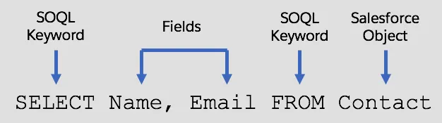
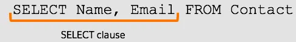
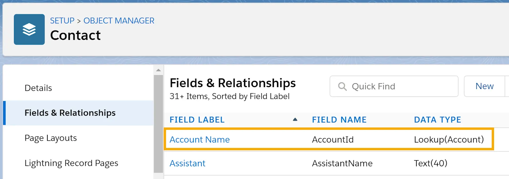
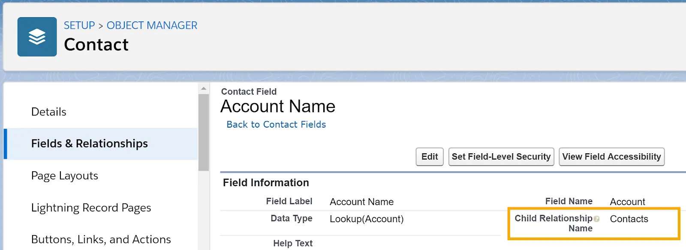
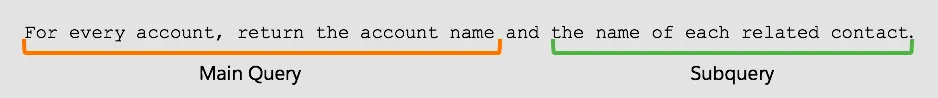

# SOQL (Salesforce Object Query Language):

<!--
```apex
SELECT fieldList [subquery][...]
[TYPEOF typeOfField whenExpression[...] elseExpression END][...]
FROM objectType[,...] 
    [USING SCOPE filterScope]
[WHERE conditionExpression]
[WITH [DATA CATEGORY] filteringExpression]
[GROUP BY {fieldGroupByList|ROLLUP (fieldSubtotalGroupByList)|CUBE (fieldSubtotalGroupByList)} 
    [HAVING havingConditionExpression] ] 
[ORDER BY fieldOrderByList {ASC|DESC} [NULLS {FIRST|LAST}] ]
[LIMIT numberOfRowsToReturn]
[OFFSET numberOfRowsToSkip]
[FOR {VIEW  | REFERENCE}[,...] ]
      [ UPDATE {TRACKING|VIEWSTAT}[,...] ]
```
-->

***syntax:***




<table>
<tr> 
<td width="400vw">
    
***clause:***    
</td>
<td>

***example:***
</td>
</tr>  
<tr> 
<td>
    
<details>
<summary><b><em> SELECT </em></b></summary>
<p>
    
```apex
// what fields of record   
```

</p>    
</details>  
    
<details>
<summary><b><em> FROM </em></b></summary>
<p>
    
```apex
// records FROM which object    
```

</p>    
</details> 
    
<details>
<summary><b><em> WHERE </em></b></summary>
<p>
    
```apex
// what condition  
```
- The WHERE clause sets the conditions that a record must match to be selected and returned. 
- You can also define the WHERE clause to filter using more than one condition. 
- ***There are multiple ways to do this using three operators:*** 
    - <b>``AND``</b> : 
    ```
    WHERE FirstName = 'Stella' AND LastName = 'Pavlova'
    ```  
    - <b>``OR``</b> : 
    ```
    WHERE LastName = 'James' OR LastName = 'Barr'
    ```
    - <b>``IN``</b> :
    ```
    WHERE LastName IN ('James', 'Barr', 'Nedaerk', 'Forbes')
    ```
    ```
    WHERE Id IN (SELECT AccountId FROM Opportunity)
    ```
    - <b> is equal to var ``idd`` </b> :
    ```
    WHERE id =: idd
    ```
    - <b> name contains subString </b> :
    ```
    WHERE name ='%test%'
    ```
    
</p>    
</details> 

<details>
<summary><b><em> ORDER BY</em></b></summary>
<p>
    
```apex
// get in what ORDER
```
- **ASC** Returns results in ascending order
```
    ORDER BY Name ASC
```
- **DESC** Returns results in descending order
```
    ORDER BY Email DESC
```    
- Returns null records at the beginning (NULLS FIRST) or end (NULLS LAST)
```
   ORDER BY Email NULLS LAST 
```    
    
</p>    
</details> 
    
<details>
<summary><b><em> LIMIT </em></b></summary>
<p>
    
```apex
// how many records to get
```
example:
    
```
    SELECT Email, Name FROM Contact LIMIT 5
```    
</p>    
</details> 
    

   
</td>
<td>
    
```apex
SELECT Name,Phone 
FROM Account 
WHERE (Name = 'SFDC Computing' AND NumberOfEmployees>25)
ORDER BY Name
LIMIT 10
```
</td>
</tr>  
</table>    
    
    
- **The SELECT clause and the FROM clause are required.**    
- Other Clauses are Optional.
    
    
<br/>

# Create SOQL Queries in method in Apex Classes

### Soql to fetch record in a varible
```apex
Account oneAccountOnly = [SELECT Name,Phone FROM Account LIMIT 1];
```

<br/>

### Soql to make a list of records
```apex
Account[] accts = [SELECT Name,Phone FROM Account 
                   WHERE (Name='SFDC Computing' AND NumberOfEmployees>25)
                   ORDER BY Name
                   LIMIT 10];
```

<br/>

### soql with for loop
```apex
for (variable : [soql_query]) {
    code_block
}
```

<br/>


# Create Relationship Queries with Standard Objects:
***To get records for a:***
- **Child object**, and include fields from a related parent object, use a **child-to-parent** query.
- **Parent object**, and include fields from a related child object, use a **parent-to-child** query.

Note: ***Before we can decide which type of query to use, we need to know how our two objects, Contact and Account, are related. Which is the parent and which is the child?***

### ***Master Detail Relationship***
> ***A master-detail relationship is a one-to-many relationship. The master object (the parent) can have many detail objects (children), but each detail object (child) has only one master object (parent).***

<details>
<summary> <em><b>For example,</b> Contact has an AccountId field with the data type Lookup(Account).</em></summary>
<p>
    
---

<div align="center"> 

<a href="#"></a>    
    
<a href="#"></a>

</div>

---
    
</p>
</details>


<br/>

### Create a Child to Parent Query:
```apex
// for every contact return the contact name and the parent account name.
SELECT Name, Account.Name FROM Contact
```

<br/>

### Create a Parent to Child Query:
***requirement:***

<a href="#"></a>

***solution:***

<a href="#"></a>

```apex
SELECT Name, (SELECT Name FROM Contacts) FROM Account
```

***This query runs in three parts:***
- The query selects an account and gets the account Name field. That’s the main query (the outer query).
- Next, the query looks at the account’s related contacts, and gets the Name field for each. That’s the subquery (the inner query).
- Then it moves on to the next account and repeats the process until it has selected all accounts.

<br/>


### Filtering with a sub-Query :
```apex
SELECT Name, (SELECT Name FROM Contacts) FROM Account WHERE Id IN (SELECT AccountId FROM Contact WHERE LastName = 'Forbes')
```

***This query does four things.***
- The query finds contacts with the last name Forbes and returns the value of each contact’s AccountId field. (The WHERE clause subquery does that.)
- Next, it finds the value of that AccountId in the Id field of an account and gets the name for that account. (The main WHERE clause does that.)
- Then the query looks at the account’s related contacts, and gets the name of each contact. (The main query’s subquery does that.)
- Finally, the main query returns the name of each account that has a related contact with the last name Forbes, and for each of those accounts, the names of all related contacts.


<br/>

<br/>


# Working with Custom Objects:

### Query Custom Objects
```apex
    SELECT Address__c, Picture__c, Broker__c FROM Property__c
```


### Create a Child-to-Parent Query
```apex
    SELECT Address__c, Picture__c, Broker__c.Name FROM Property__c
```


> ***Error Message:***  
>  Didn’t understand relationship ‘Broker__c’ in field path. If you’re attempting to use a custom relationship, be sure to append the ‘\_\_r’ after the custom relationship name.


>***solution:***  
>  Use the Custom Relationship Name in the Query.
```apex
    SELECT Address__c, Picture__c, Broker__r.Name FROM Property__c
```


### Create a Parent-to-Child Query
Requirement:
“Get the names of all brokers with the address and price of all properties assigned to each broker.”

```apex
    SELECT Name, (SELECT Address__c, Price__c FROM Properties__r) FROM Broker__c
```


<br/>

<br/>

<br/>


# Aggregate Functions for SOQL Queries
<div align="center">
    
    

    
</div>

<table class="featureTable sort_table">
<tbody class="tbody">
<tr>
<td><strong>Aggregate Function</strong></td>
<td><strong>Description</strong></td>
<td><strong>Example</strong></td>
</tr>
<tr>
<td>COUNT()</td>
<td>Returns the number of rows that are associated with the field</td>
<td>SELECT COUNT(Name)<br />FROM Broker__c</td>
</tr>
<tr>
<td>COUNT_DISTINCT()</td>
<td>Returns the number of unique rows that match the query criteria</td>
<td>SELECT COUNT_DISTINCT(City__c)<br />FROM Property__c</td>
</tr>
<tr>
<td>MIN()</td>
<td>Returns the minimum value of a field</td>
<td>SELECT MIN(Days_On_Market__c)<br />FROM Property__c</td>
</tr>
<tr>
<td>MAX()</td>
<td>Returns the maximum value of a field</td>
<td>SELECT MAX(Beds__c)<br />FROM Property__c</td>
</tr>
<tr>
<td>AVG()</td>
<td>Returns the average value of a numeric field</td>
<td>SELECT City__c, AVG(Days_On_Market__c)<br />FROM Property__c<br />GROUP BY City__c</td>
</tr>
<tr>
<td>SUM()</td>
<td>Returns the total value of a numeric field</td>
<td>SELECT SUM(Price__c), Broker__r.Name<br />FROM Property__c<br />GROUP BY Broker__r.Name</td>
</tr>
</tbody>
</table>


<br/>

<br/>

<br/>


## Important Query Examples

***``Account is Parent Object and Contact is child Object``***

### Query related child object of parent object 
**``query id and name of contacts that are related to account``**
```soql
SELECT Id , Name , (SELECT Id, Name FROM Contacts)  FROM Account
```

### Query related Parent object of child object
**``query id and name of contact along with id of account they are related to``**

```soql
SELECT Id , Name , Account.Id  FROM Contact
```
```soql
SELECT Id , Name , AccountId  FROM Contact
```

<details>
<summary><b><em>Question: Why do we run sub query to get related contacts of an account ? </em></b></summary>
<p>
    
because a Parent can have many children, but a child can't have many parents. 
    
wait, what if a contact is related to more than one account? how to query all the related accounts of a contact??????????

<br/>

</p>
</details>

<br/>


### Query only those Account which have related contact
???

***``???``***

### Query records of a custom object
???

### Query records of a custom object that are related to another standard object
???

### Query records of a standard object that are related to another custom object
???

### query account that does not have related opportunity
```
[SELECT Id,Name FROM Account
                     WHERE Id NOT IN (SELECT AccountId FROM Opportunity)]
```


### get List of Related opportunities of current Account
```apex
for(Account acc: accList){
    if(acc.Phone != oldAccountMap.get(acc.Id).Phone){                
    // get List of Related opportunities of current Account
    List<Opportunity> relatedOppList = [SELECT Id , Phone__c FROM Opportunity Where AccountId=acc.Id];
    }
}

```


<br/>

<br/>

<br/>

<br/>

<br/>

<br/>

<br/>

<br/>

<br/>


---
***resources:***

1. [soql-for-admins](https://trailhead.salesforce.com/en/content/learn/modules/soql-for-admins)
2. [SOQL & SOSL](https://developer.salesforce.com/docs/atlas.en-us.224.0.soql_sosl.meta/soql_sosl/)

---

